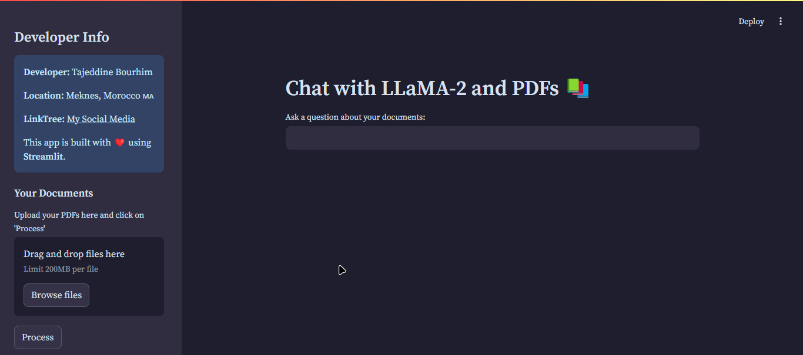

# Chat with LLaMA-2 and PDFs

This project provides a Streamlit-based web application that allows users to chat with a conversational AI model powered by **LLaMA-2** and retrieve answers based on uploaded PDF documents. The application processes the text from PDFs, splits it into chunks, stores it in a FAISS vector store, and integrates it with a conversational AI model for intelligent document-based question-answering.

### Application Interface



## Table of Contents

1. [Features](#features)
2. [Dependencies](#dependencies)
3. [Setup and Installation](#setup-and-installation)
4. [How to Run](#how-to-run)
5. [Hardware Recommendations](#hardware-recommendations)
6. [Code Walkthrough](#code-walkthrough)
7. [Future Enhancements](#future-enhancements)
8. [License](#license)

---

## Features

1. **PDF Text Extraction**:

   - Extracts text from multiple uploaded PDF documents.
   - Handles edge cases where some pages might fail to extract text.

2. **Chunk-Based Text Splitting**:

   - Splits large text into manageable chunks to improve vectorization and search efficiency.

3. **Semantic Search with FAISS**:

   - Creates a FAISS vector store to perform semantic search over text chunks.

4. **Conversational AI with LLaMA-2**:

   - Integrates conversational AI models using the Hugging Face Transformers library.
   - Select from models based on your hardware capabilities:
     - **CPU-Optimized**: `google/flan-t5-small`
     - **Medium GPU**: `meta-llama/Llama-2-7b-chat-hf`
     - **High-End GPU**: `meta-llama/Llama-2-13b-chat-hf`

5. **Customizable Embeddings**:

   - Select from lightweight, medium, or high-performance embedding models:
     - **CPU-Optimized**: `sentence-transformers/all-MiniLM-L6-v2`
     - **Medium GPU**: `hkunlp/instructor-large`
     - **High-End GPU**: `hkunlp/instructor-xl`

6. **Streamlit Web Interface**:
   - Upload PDFs, ask questions, and view answers interactively.
   - Sidebar for document uploads and processing.

---

## Setup and Installation

### Dependencies

The following libraries are required to run the application. Each serves a specific purpose in enabling PDF processing, embedding generation, vector storage, and conversational AI integration.

#### 1. **`streamlit`**:


- For creating the web interface of the chat application.

#### 2. **`python-dotenv`**:


- To load environment variables, such as Hugging Face API tokens, from a `.env` file.

#### 3. **`PyPDF2`**:


- For parsing and extracting text from PDF files.

#### 4. **`langchain`**:


- A framework for building AI chains, including tools for memory, embeddings, and retrieval chains.

#### 5. **`transformers`**:


- Hugging Face's library for working with large language models (LLMs) like LLaMA-2 and for embedding pipelines.

#### 6. **`faiss-cpu`**:


- To create and query FAISS vector stores using CPU.

7. **`sentence-transformers`**:


- Provides access to pre-trained embedding models (e.g., `all-MiniLM-L6-v2`) for semantic similarity calculations.

### Prerequisites

1. Python 3.8 or higher
2. Virtual environment (recommended)

### Installation

1. Clone the repository:

   ```bash
   git clone https://github.com/scorpionTaj/Chat-with-LLaMA-2-and-PDFs.git
   cd Chat-with-LLaMA-2-and-PDFs
   ```

2. Install dependencies:

   ```bash
   pip install -r requirements.txt
   ```

3. Set up environment variables (optional, for Hugging Face API tokens):
   ```bash
   touch .env
   echo "HUGGINGFACEHUB_API_TOKEN=your_token_here" > .env
   ```

---

## How to Run

1. Start the Streamlit application:

   ```bash
   streamlit run app.py
   ```

2. Open your browser and navigate to the provided URL (e.g., `http://localhost:8501`).

3. Upload your PDF files in the sidebar, process them, and ask questions in the main interface.

---

## Hardware Recommendations

### **For Model Selection**

| Model                            | Suitable Hardware              | Description                                   |
| -------------------------------- | ------------------------------ | --------------------------------------------- |
| `google/flan-t5-small`           | CPU                            | Lightweight model, ideal for slower machines. |
| `meta-llama/Llama-2-7b-chat-hf`  | Medium GPUs (e.g., NVIDIA T4)  | Robust model for conversational AI.           |
| `meta-llama/Llama-2-13b-chat-hf` | High-end GPUs (e.g., RTX 4090) | High-performance model for advanced GPUs.     |

### **For Embedding Model Selection**

| Embedding Model                          | Suitable Hardware              | Description                                 |
| ---------------------------------------- | ------------------------------ | ------------------------------------------- |
| `sentence-transformers/all-MiniLM-L6-v2` | CPU                            | Lightweight embedding model.                |
| `hkunlp/instructor-large`                | Medium GPUs (e.g., NVIDIA T4)  | Balanced performance and accuracy.          |
| `hkunlp/instructor-xl`                   | High-end GPUs (e.g., RTX 4090) | High-accuracy embedding for large datasets. |

### Customization

- **Change Models**: Modify `model_name` in `get_conversation_chain` for different conversational models.
- **Change Embeddings**: Update `embedding_model` in `get_vectorstore` for different embedding models.

---

## Code Walkthrough

### 1. **PDF Text Extraction**

The `get_pdf_text` function extracts text from uploaded PDF documents:

```python
def get_pdf_text(pdf_docs):
    text = ""
    for pdf in pdf_docs:
        pdf_reader = PdfReader(pdf)
        for page in pdf_reader.pages:
            if page.extract_text():
                text += page.extract_text()
    return text
```

### 2. **Chunk-Based Text Splitting**

The `get_text_chunks` function splits large text into smaller, overlapping chunks:

```python
def get_text_chunks(text):
    text_splitter = CharacterTextSplitter(
        separator="\n",
        chunk_size=1000,
        chunk_overlap=200,
        length_function=len
    )
    return text_splitter.split_text(text)
```

### 3. **FAISS Vector Store**

The `get_vectorstore` function creates a FAISS vector store using customizable embedding models:

```python
def get_vectorstore(text_chunks):
    embeddings = HuggingFaceEmbeddings(model_name="sentence-transformers/all-MiniLM-L6-v2")
    return FAISS.from_texts(texts=text_chunks, embedding=embeddings)
```

### 4. **Conversational Chain**

The `get_conversation_chain` function integrates a conversational model for question-answering:

```python
def get_conversation_chain(vectorstore):
    tokenizer = AutoTokenizer.from_pretrained("meta-llama/Llama-2-7b-chat-hf")
    model = AutoModelForCausalLM.from_pretrained("meta-llama/Llama-2-7b-chat-hf", device_map="auto", torch_dtype="float32")
    llm_pipeline = pipeline("text-generation", model=model, tokenizer=tokenizer, device=-1)
    llm = HuggingFacePipeline(pipeline=llm_pipeline)
    memory = ConversationBufferMemory(memory_key='chat_history', return_messages=True)
    return ConversationalRetrievalChain.from_llm(llm=llm, retriever=vectorstore.as_retriever(), memory=memory)
```

### 5. **Streamlit Interface**

The `main` function manages the Streamlit UI:

```python
def main():
    st.set_page_config(page_title="Chat with LLaMA-2 and PDFs", page_icon=":books:")
    st.header("Chat with LLaMA-2 and PDFs :books:")
    pdf_docs = st.file_uploader("Upload your PDFs here and click on 'Process'", accept_multiple_files=True)
    if st.button("Process"):
        raw_text = get_pdf_text(pdf_docs)
        text_chunks = get_text_chunks(raw_text)
        vectorstore = get_vectorstore(text_chunks)
        st.session_state.conversation = get_conversation_chain(vectorstore)
```

---

## Future Enhancements

1. Add support for more file formats (e.g., Word documents).
2. Implement real-time chat streaming for better interactivity.
3. Add multilingual support for PDFs and chat responses.

---

## Troubleshooting

### 1. Error: "Out of Memory"

- **Cause**: The selected model or embedding is too large for your hardware.
- **Solution**: Switch to a smaller model, such as `google/flan-t5-small` or `sentence-transformers/all-MiniLM-L6-v2`.

### 2. Streamlit App Doesn't Start

- **Cause**: Missing dependencies or incorrect Python version.
- **Solution**: Verify Python version (>= 3.8) and reinstall dependencies:
  ```bash
  pip install -r requirements.txt
  ```

---

## License

This project is licensed under the MIT License. See the `LICENSE` file for details.
